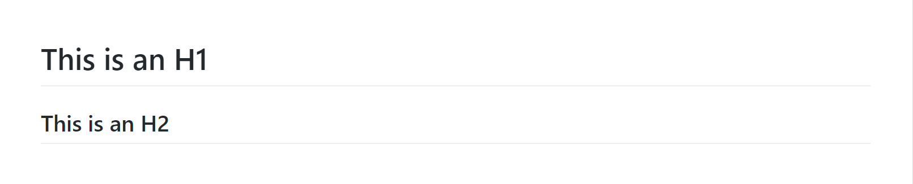
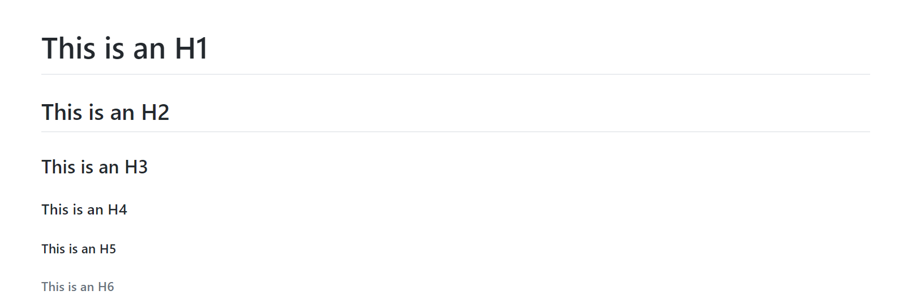
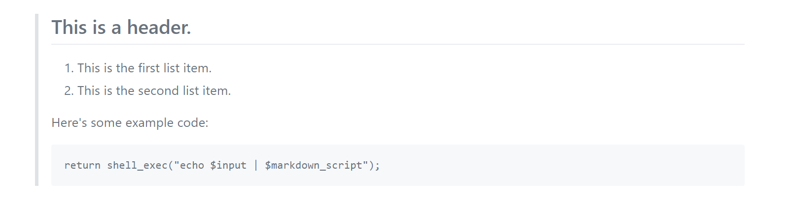
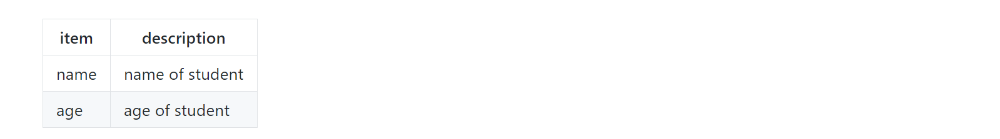

markdown基础语法介绍

# 标题
markdown的标题有两种写法
## setext方式
**源码如下：**
```
This is an H1
=============

This is an H2
-------------
```
**效果如下：**


## atx方式
**源码如下：**
```
# This is an H1

## This is an H2

### This is an H3

#### This is an H4

##### This is an H5

###### This is an H6
```
*备注：如果你愿意，也可以在标题末尾加上**任意数量**的#来关闭标签，就像这样的：# This is an H1 #*

**效果如下：**


# 块引用
markdown的块引用有几个特点：
1. 懒人模式，一大段文字的引用，可以只在第一行前面加上块引用标签
2. 嵌套引用，引用块里面还可以嵌套引用块
3. 嵌套其他markdown元素，例如：列表等

## 语法
**源码如下：**
```
> This is a blockquote with two paragraphs. Lorem ipsum dolor sit amet,
> consectetuer adipiscing elit. Aliquam hendrerit mi posuere lectus.
> Vestibulum enim wisi, viverra nec, fringilla in, laoreet vitae, risus.
> 
> Donec sit amet nisl. Aliquam semper ipsum sit amet velit. Suspendisse
> id sem consectetuer libero luctus adipiscing.
```
**效果如下：**


## 嵌套
**源码如下：**
```
> ## This is a header.
> 
> 1.   This is the first list item.
> 2.   This is the second list item.
> 
> Here's some example code:
> 
>     return shell_exec("echo $input | $markdown_script");
```
**效果如下：**


# 列表
markdown的列表分有序列表和无序列表两种，不管是有序还是无序列表都支持多级子列表
## 有序列表
**源码如下：**
```
1. Bird
2. McHale
3. Parish
```
**效果如下：**


## 无序列表
**源码如下：**
```
* Red
* Green
* Blue
```
**效果如下：**

*无序列表的起始符号还可以是：-/+（减号/加号）*
## 多级列表
**源码如下：**
```
1. A
2. B
    1. B1
    2. B2
3. C


* A
* B
    * B1
    * B2
* C
```
**效果如下：**


# 代码块
markdown的代码库以四个以上空格或者一个TAB开头

**源码如下：**
    
    import os
    os.getcwd()
    print("hello")
    
    if __file__ == "__main__":
        print("main")
    else:
        print("other")

**看到效果了吗？**

# 横线
markdown的横线有多种

**源码如下：**
```
* * *

***

*****

- - -

---------------------------------------
```
**效果如下：**


# 链接
**源码如下：**

    [baidu](www.baidu.com)

**效果如下：**


**如果想要显示图片：**

# 表格
**源码如下：**
```
| item | description |
| --- | --- |
| name | name of student |
| age | age of student |
```
**效果如下：**


**说明：第二行的| -- |可以控制对其方式**
* | :--- | 表示左对齐
* | ---: | 表示右对齐
* | :---: | 表示居中对其
